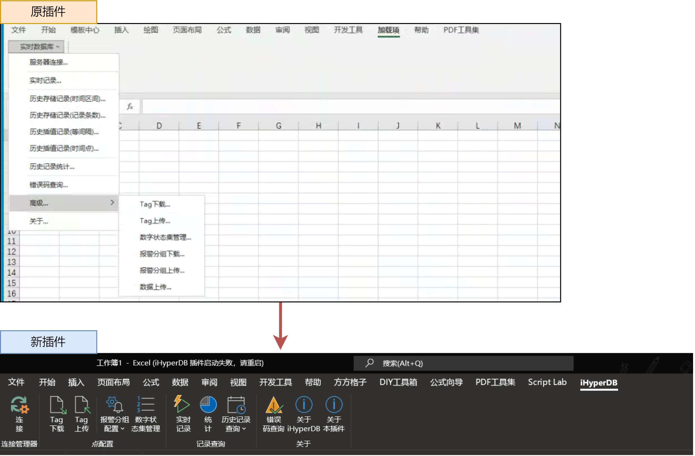
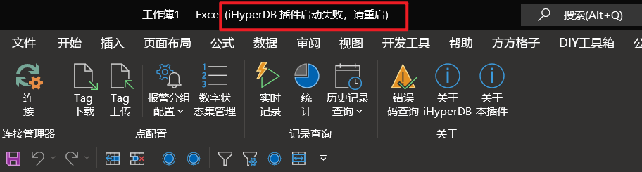
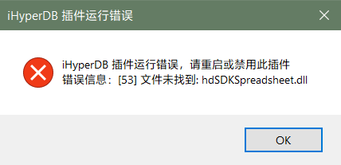
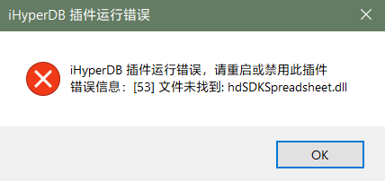
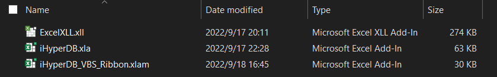
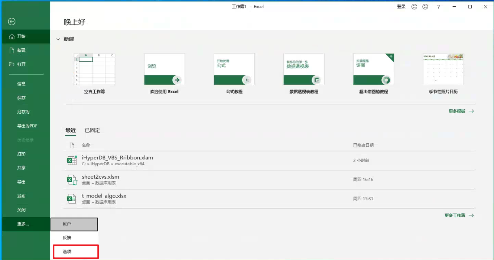
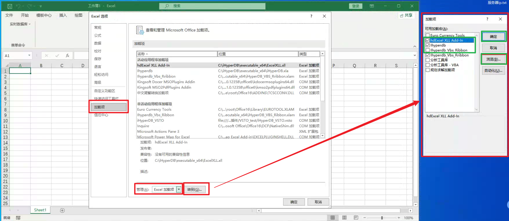
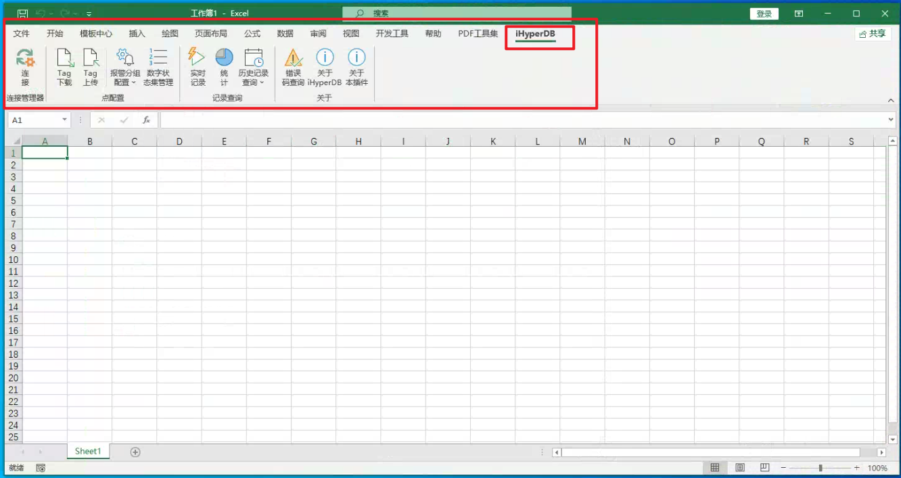
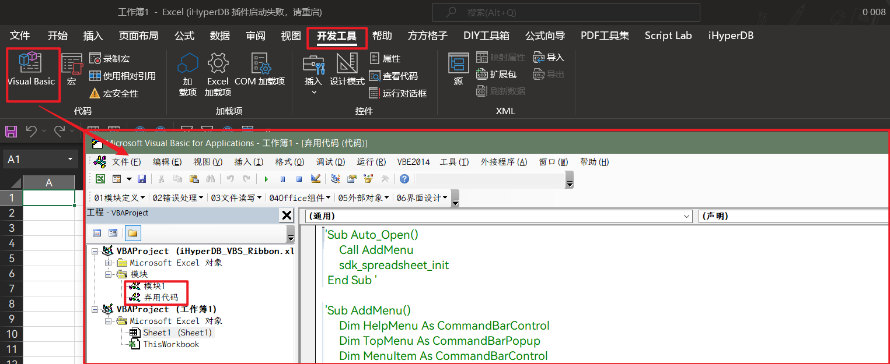
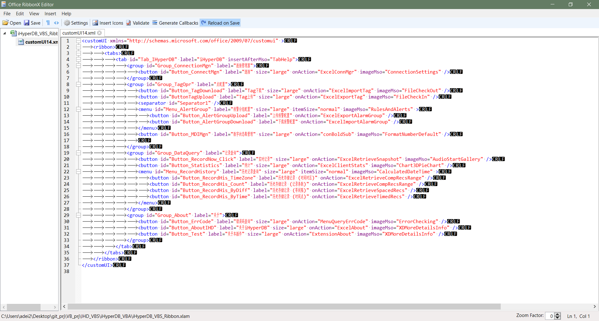

[toc]

# 1. 插件介绍
本插件基于原官方 xla 插件制作，使用 Ribbon 界面替代原来的下拉选择窗口，提高插件操作效率。

仅修改 UI 生成相关代码、添加错误处理代码，其他底层代码与原插件基本相同

# 2. 插件功能
1. 适配原插件的功能
1. 更高效的界面设计：常用功能快捷点击
1. 初始化失败时的状态显示
    1. 插件初始化成功 - 标题栏正常显示
    1. 插件初始化失败
        1. 标题栏最后显示 `(iHyperDB 插件启动失败，请重启)`
            
        1. 启动时，弹出错误弹窗
            
2. 运行过程中的错误提示
    运行过程中，遇到错误，弹出错误弹窗，确认后仍能操作表格
    
# 插件运行要求
电子表格软件及版本：Windows Office 2007 及以上版本
1. 不支持WPS
1. 不支持 Excel 2003 或更低版本
    要在更低版本使用，请尝试使用原版插件 (.xla格式)
1. 不支持MacOS、Linux 
    MacOS 无法安装 iHD 客户端，Linux 无法安装 Office 和 iHD 客户端。 
    MacOS 和 Linux 用户可在虚拟机或远程的 Windows 环境中操作 iHD
1. 在安装新插件前，旧插件应该可用
    若旧插件不可用，请检查安装配置。建议重装 iHD 应用客户端，并在安装过程中勾选"安装电子表格插件"
1. 客户端的 iHD 版本应与配置服务器、数据节点服务器版本相同
    1. 版本号相同 (3.7.1 / 3.7.1-P7 / 3.6.6-P3)
    1. 架构相同 (32位 / 64位)

# 3. 插件安装
1. 相关文件
    
    1. `ExcelXLL.xll` Excel 加载项。
        用于插件的必要加载项。类似于其他软件中的 `.dll`文件，但`.xll`文件仅 Excel 能够加载。
        在安装 iHD 时，若已经勾选了 “安装电子表格插件插件”，则此文件应该存在于`iHD 安装目录/executable_64/` (32 位的 iHD 是 `iHD 安装目录/executable/`)路径下，并在 Excel 中自动加载。
    1. `iHyperDB.xla` 旧版 Excel 插件
        安装新版插件后，需要禁用旧版插件，以防止插件发生冲突
    1. `iHyperDB_VBS_Ribbon.xlam` 新版 Excel 插件
        需要手动安装，并设置，才能启用
2. 安装步骤
    1. 总览
        1. 复制新插件到原插件目录
        1. 在 Excel 中禁用旧插件、并启用新插件
        1. 重启 Excel
    1. 复制新插件到原插件目录
        将 `.xll`文件 和 `.xlam`文件复制到原插件的安装目录下
        并检查`ExcelXLL.xll`文件是否存在，若没有也要复制到此路径下
        1. 32 位 iHD 插件路径：`iHD 安装路径/executable`
        1. 64 位 iHD 插件路径：`iHD 安装路径/executable_x64`
    1. 在 Excel 中添加新插件和`xll`文件
        1. 打开 Excel，打开`加载项`菜单
            **文件 --> 选项 --> 加载项**
            
        1. 选择`Excel 加载项`，在弹窗中加入`.xll`文件 和 `.xlam`文件
            ()点击**浏览**，在 插件目录 选中 `xll`文件 和 `xlam`文件
            (若 `.xll` 文件已经在列表中，则不需要再次添加)
            
    1. 在 Excel 中禁用旧插件、并启用新插件
        【取消勾选】旧插件`Ihyperdb`
        【勾选】新插件`Ihyperdb_Vbs_Ribbon`
        【勾选】XLL文件`HdExcel XLL Add-in`
    1. 重启 Excel ，检查新插件是否出现，以及插件的工作情况
        

# 4. 插件开发
1. 插件代码 -- 使用 Excel 打开 `.xlam` 文件，在 VBE 中即可看到相关代码
    
1. 插件界面 -- RibbonUI XML
    使用 Ribbon X Editor 进行修改
    软件网址：[https://github.com/fernandreu/office-ribbonx-editor](https://github.com/fernandreu/office-ribbonx-editor)
    

